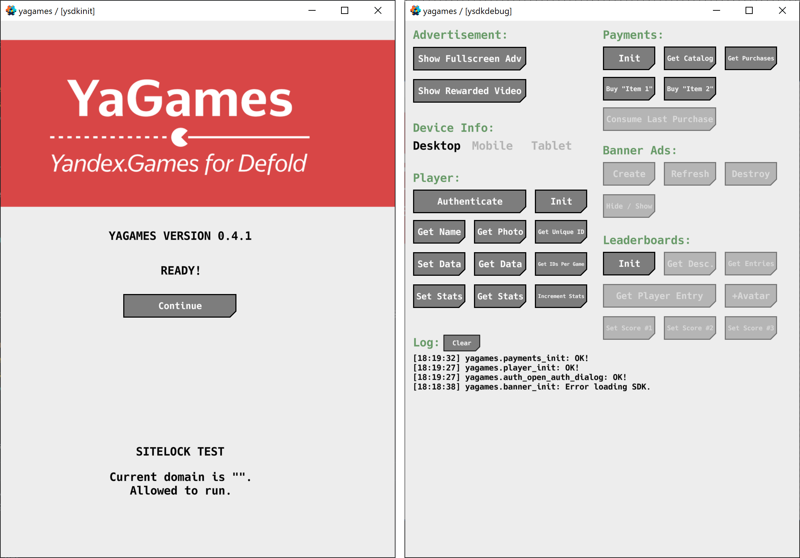
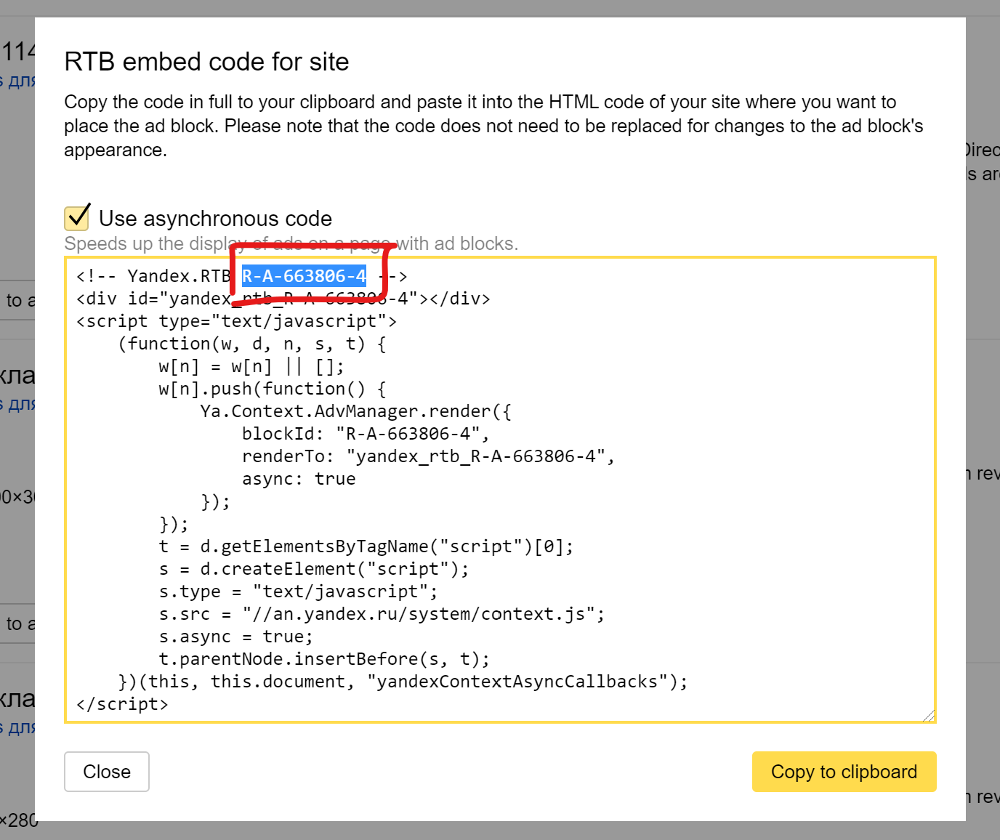

[](https://github.com/indiesoftby/defold-yagames)

# YaGames - Yandex.Games for Defold

*This is an open-source project. It is not affiliated with Yandex LLC.*

YaGames is the Yandex.Games extension for the [Defold](https://www.defold.com/) game engine. [Yandex.Games](https://yandex.com/games/) is a collection of browser games for smartphones and computers. The games are available in Yandex Browser and the Yandex app. Games from the catalog are displayed in Yandex recommendation systems, which have a total audience of more than 50 million users per month.

You can check [here](https://radar.yandex.ru/yandex) the size of Yandex.Games audience. The platform is constantly growing.

## Installation

You can use it in your own project by adding this project as a [Defold library dependency](http://www.defold.com/manuals/libraries/). Open your `game.project` file and in the dependencies field under project add:

https://github.com/indiesoftby/defold-yagames/archive/master.zip

Or point to the ZIP file of a [specific release](https://github.com/indiesoftby/defold-yagames/releases).

**Note:** Use [version 0.2.0](https://github.com/indiesoftby/defold-yagames/archive/0.2.0.zip) for the old Defold 1.2.177 or lower.

## Getting Started

* **[🎓 Tutorial: "Releasing HTML5 games on Yandex.Games"](https://defold.com/2021/04/21/Releasing-games-on-Yandex/) - How to add the Yandex.Games SDK to a Defold game and how to submit your game to the Yandex.Games catalog.**
* [📚 The official documentation](https://yandex.ru/dev/games/doc/dg/concepts/about.html?lang=en).
* [💬 The official Telegram chat](https://t.me/yagamedev) where you can talk with representatives from Yandex. Feel free to ask questions in English!
* [💬 The Telegram chat about Defold](https://t.me/DefoldEngine) for Russian-speaking users.
* [💬 The Defold forum topic](https://forum.defold.com/t/yagames-yandex-games-sdk-for-defold/66810) about the YaGames extension.

### Checklist For Releasing Game

1. [Sign up as a developer](https://yandex.ru/dev/games/doc/dg/concepts/about.html?lang=en).
2. Translate your game to the Russian language.
3. Prepare assets for the catalogue:
    - Icon 512 x 512 px.
    - Cover 800 x 470 px.
    - Screenshots.
4. Add [the extension](https://github.com/indiesoftby/defold-yagames/archive/master.zip) as a Defold library dependency to your project. **You can publish your game on Yandex.Games from this moment. It fully meets [the requirements](https://yandex.ru/dev/games/doc/dg/concepts/requirements.html?lang=en).**
5. Enable monetization and earn revenue from placing ad blocks in your game. Ad blocks are available in the following formats:
    - **Interstitial blocks** - ad blocks that completely cover the app background and show up at certain points (for example, when accessing the next game level). *Important: Mute sounds before showing the ad.*
    - **Rewarded videos** - blocks with video ads that the user can choose to view and earn a reward or in-game currency. *Important: Mute sounds before showing the ad.*
    - **RTB ad blocks (banners)** - display both contextual (content-based) ads and media ads.
    - **In-game purchases** - earn revenue by providing paid services to your users.
6. *(Optional)* Enable [Native Cache](https://yandex.ru/dev/games/doc/dg/concepts/native-cache-settings.html?lang=en) support.
    1. Set the path to the file `yandex-manifest.json` in the `game.project` settings.
    2. Copy the `yagames/manifests/web/yandex-manifest.json` file to the root directory of your release build.
    3. Edit the list of all game files inside your `yandex-manifest.json`, and update the path to the icon. Omit `sw.js` and `yandex-manifest.json`.
7. *(Optional)* Enable Service Worker support - browser games should run both offline and online, however unstable or slow the web connection might be. To meet these criteria, integrate Service Worker into your game.
    1. Set the path to the file `sw.js` in the `game.project` settings.
    2. Copy the `yagames/manifests/web/sw.js` file to the root directory of your release build.
    3. Edit the list of all game files inside your `sw.js`. Omit `sw.js` and `yandex-manifest.json`.
    4. You should increment the version inside `sw.js` on every update of your game on Yandex.Games.
8. Publish your game [in the Yandex.Games catalogue](https://games.yandex.ru/console/).

### Best Practices

1. The YaGames extension imitates a real API on *non-HTML5* platforms. The idea is to allow to you quickly implement API on your favourite platform (macOS, Windows, Linux) and don't spend time on slowly rebuilding/uploading the game to the Yandex.
2. The code from `yagames/manifests/web/engine_template.html` is always added to your HTML5 template. This behaviour can't be disabled. Tip: use Git-branching for every platform and do not mix platform-specific code between them.

## Code Examples

Take a look at the demo project inside `example` directory. It has quite a few buttons to test all APIs. You can use it in your game as a debug screen or simply [download/upload a pre-built .zip archive](https://github.com/indiesoftby/defold-yagames/blob/gh-pages/demo_no-sw_no-native-cache.zip?raw=true) to make sure that you implemented SDK in the right way.



### 1. Initialization

To get started, you need to initialize the SDK using the `init` method.

```lua
local yagames = require("yagames.yagames")

local function init_handler(self, err)
    if err then
        print("Something bad happened :(", err)
    end
end

function init(self)
    yagames.init(init_handler)
end
```

### 2. Interstitial Ad

Interstitial ads are ad blocks that completely cover the app background and show up before a user gets the data requested (for example, accessing the next game level).

*Don't call interstitial ads more often than once **every three minutes**. The ad window may fail to open if the calls are too frequent.*

* `open` - Called when an ad is opened successfully.
* `close` - Called when an ad is closed, an error occurred, or on ad failed to open due to too frequent calls. Used with the `was_shown` argument (type `boolean`), the value of which indicates whether an ad was shown.
* `offline` - Called when the network connection is lost (when offline mode is enabled).
* `error` - Called when an error occurrs. The error object is passed to the callback function.

The `close` callback is called in any situations, even if there was an error.

```lua
local yagames = require("yagames.yagames")

local function adv_open(self)
    -- You should switch off all sounds!
end

local function adv_close(self, was_shown)
    -- You can switch sounds back!
end

local function adv_offline(self)
    -- Internet is offline
end

local function adv_error(self, err)
    -- Something wrong happened :(
end

function on_message(self, message_id, message)
    if message_id == hash("show_fullscreen_adv") then
        yagames.adv_show_fullscreen_adv({
            open = adv_open,
            close = adv_close,
            offline = adv_offline,
            error = adv_error
        })
    end
end
```

### 3. Rewarded Videos

Rewarded videos are video ad blocks used to monetize games and earn a reward or in-game currency.

* `open` - Called when a video ad is displayed on the screen.
* `rewarded` - Called when a video ad impression is counted. Use this function to specify a reward for viewing the video ad.
* `close` - Called when a user closes a video ad or an error happens.
* `error` - Called when an error occurrs. The error object is passed to the callback function.

The `close` callback is called in any situations, even if there was an error.

```lua
local yagames = require("yagames.yagames")

local function rewarded_open(self)
    -- You should switch off all sounds!
end

local function rewarded_rewarded(self)
    -- Add coins!
end

local function rewarded_close(self)
    -- You can switch sounds back!
end

local function rewarded_error(self, err)
    -- Something wrong happened :(
end

function on_message(self, message_id, message)
    if message_id == hash("show_rewarded_video") then
        yagames.adv_show_rewarded_video({
            open = rewarded_open,
            rewarded = rewarded_rewarded,
            close = rewarded_close,
            error = rewarded_error
        })
    end
end
```

## The `game.project` Settings

```ini
[yagames]
sdk_init_options = {}
service_worker_url = sw.js
manifest_url = yandex-manifest.json
```

* `sdk_init_options` - The JavaScript code. The Yandex Games SDK initialization options for [the `YaGames.init`](https://yandex.ru/dev/games/doc/dg/sdk/sdk-about.html). Example: `{ orientation: { value: "landscape", lock: true } }`.
* `service_worker_url` - Relative URL to the Service Worker file. Usually it's `sw.js`. Set the URL to enable Service Worker.
* `manifest_url` - URL to the Web App Manifest file. Set the URL to enable support of Yandex Native Cache.

## Lua API

Yandex.Games JavaScript SDK uses ES6 Promise for asynchronous operations. For Lua API promises were replaced with callback functions with arguments `(self, err, result)`, where

- `self` <kbd>userdata</kbd> - Script self reference.
- `err` <kbd>string</kbd> - Error code if something went wrong.
- `result` - Data if the operation should return something.

### Lua <-> JS

The best way to integrate SDK into your game is to read [the official documentation](https://yandex.ru/dev/games/doc/dg/concepts/about.html?lang=en) and to use corresponding Lua API functions. The table below helps to do that:

| Yandex.Games JS SDK | YaGames Lua API |
| ------------------- | --------------- |
| `YaGames.init(options)` | `yagames.init(callback)`<br>The `options` is a JavaScript object `{}`, and it can be set in the `yagames.sdk_init_options` setting. |
| **Device Info** |  |
| `ysdk.deviceInfo.isDesktop()` | `yagames.device_info_is_desktop()` |
| `ysdk.deviceInfo.isMobile()` | `yagames.device_info_is_mobile()` |
| `ysdk.deviceInfo.isTablet()` | `yagames.device_info_is_tablet()` |
| **Environment** [(docs )](https://yandex.ru/dev/games/doc/dg/sdk/sdk-environment.html) |  |
| `ysdk.environment` | `yagames.environment()`<br>Returns Lua table `{ app = { id = ... }, ... }` |
| **Advertisement** [(docs )](https://yandex.ru/dev/games/doc/dg/sdk/sdk-adv.html) |  |
| `ysdk.adv.showFullscreenAdv({callbacks:{}})` | `yagames.adv_show_fullscreen_adv(callbacks)` [<kbd>Example</kbd>](#2-interstitial-ad) |
| `ysdk.adv.showRewardedVideo({callbacks:{}})` | `yagames.adv_show_rewarded_video(callbacks)` [<kbd>Example</kbd>](#3-rewarded-videos) |
| **Authentication + Player** [(docs )](https://yandex.ru/dev/games/doc/dg/sdk/sdk-player.html) |  |
| `ysdk.auth.openAuthDialog()` | `yagames.auth_open_auth_dialog(callback)` |
| `ysdk.getPlayer(options)` | `yagames.player_init(options, callback)`<br>The argument `options` is a Lua table `{ signed = boolean, scopes = boolean }`. |
| `player.setData(data, flush)` | `yagames.player_set_data(data, flush, callback)` |
| `player.getData(keys)` | `yagames.player_get_data(keys, callback)` |
| `player.setStats(stats)` | `yagames.player_set_stats(stats, callback)` |
| `player.incrementStats(increments)` | `yagames.player_increment_stats(increments, callback)` |
| `player.getStats(keys)` | `yagames.player_get_stats(keys, callback)` |
| `player.getID()` <kbd>Deprecated</kbd> | `yagames.player_get_id()` <kbd>Deprecated</kbd> |
| `player.getUniqueID()` | `yagames.player_get_unique_id()` |
| `player.getIDsPerGame()` | `yagames.player_get_ids_per_game(callback)` |
| `player.getName()` | `yagames.player_get_name()` |
| `player.getPhoto(size)` | `yagames.player_get_photo(size)` |
| **In-Game Purchases** [(docs )](https://yandex.ru/dev/games/doc/dg/sdk/sdk-purchases.html) |  |
| `ysdk.getPayments(options)` | `yagames.payments_init(options, callback)` |
| `payments.purchase(options)` | `yagames.payments_purchase(options, callback)` |
| `payments.getPurchases()` | `yagames.payments_get_purchases(callback)`<br>The result has the format `{ purchases = { ... }, signature = "..." }` |
| `payments.getCatalog()` | `yagames.payments_get_catalog(callback)` |
| `payments.consumePurchase(purchaseToken)` | `yagames.payments_consume_purchase(purchase_token, callback)` |
| **Leaderboards** [(docs )](https://yandex.ru/dev/games/doc/dg/sdk/sdk-leaderboard.html) |  |
| `ysdk.getLeaderboards()` | `yagames.leaderboards_init(callback)` |
| `lb.getLeaderboardDescription(leaderboardName)` | `yagames.leaderboards_get_description(leaderboard_name, callback)` |
| `lb.getLeaderboardPlayerEntry(leaderboardName)` | `yagames.leaderboards_get_player_entry(leaderboard_name, [options], callback)`<br>If the player doesn't have any score, you get the error `FetchError: Player is not present in leaderboard`.<br>The argument `options` is an optional Lua table `{ getAvatarSrc = "size", getAvatarSrcSet = "size" }`, where `size` can be `small`, `medium`, `large`. |
| `lb.getLeaderboardEntries(leaderboardName, options)` | `yagames.leaderboards_get_entries(leaderboard_name, [options], callback)`<br>The argument `options` is an optional Lua table `{ includeUser = boolean, quantityAround = number, quantityTop = number, getAvatarSrc = "size", getAvatarSrcSet = "size" }`, where `size` can be `small`, `medium`, `large`. |
| `lb.setLeaderboardScore(leaderboardName, score, extraData)` | `yagames.leaderboards_set_score(leaderboard_name, score, [extra_data], [callback])` |
| **Feedback** [(docs )](https://yandex.ru/dev/games/doc/dg/sdk/sdk-review.html) |  |
| `ysdk.feedback.canReview()` | `yagames.feedback_can_review(callback)`<br>The result is a table `{ value = true/false, reason = "string" }` |
| `ysdk.feedback.requestReview()` | `yagames.feedback_request_review(callback)`<br>The result is a table `{ feedbackSent = true/false }` |
| **Banner Ads** [(docs)](#banner-ads) |  |
| `-` | `yagames.banner_init(callback)` |
| `-` | `yagames.banner_create(rtb_id, options, [callback])` |
| `-` | `yagames.banner_delete(rtb_id)` |
| `-` | `yagames.banner_refresh(rtb_id, [callback])` |
| `-` | `yagames.banner_set(rtb_id, property, value)` |
| **Sitelock** [(docs)](#sitelock) |  |
| `-` | `sitelock.add_domain(domain)` |
| `-` | `sitelock.verify_domain()` |
| `-` | `sitelock.get_current_domain()` |
| `-` | `sitelock.is_release_build()` |

## Banner Ads

You can additionally monetize your game using Yandex Advertising Network *Real-Time Bidding* ad blocks. RTB block is rendered into HTML div block and placed over your game canvas.

The official documentation is here - [https://yandex.ru/support/partner2/web/products-rtb/about.html](https://yandex.ru/support/partner2/web/products-rtb/about.html?lang=en)

### Creating RTB blocks

Create an RTB block in [the Yandex Advertising Network interface](https://partner2.yandex.ru/v2/context/rtb/) and copy **RTB id** of the block:



The ad block will be displayed within 30 minutes after saving the code and placing it on the game page. 

### Styling RTB blocks

Usually, developers put banners to the sides of a page. You can apply any CSS styles to the `div` block that will contain RTB ad via the `yagames.banner_create`'s `options` argument.

The following examples require to set `width` and `height` to `100%` for the `<body>`. You should append these CSS styles to your Defold's HTML template or CSS file:
```html
<style>
body {
    height: 100%;
    width: 100%;
}
</style>
```

Left vertical banner. Width is 350px:
```css
background: #d2d2d2; width: 350px; left: 0; align-items: center; display: flex; height: 100%; justify-content: center; position: absolute;
```

Right vertical banner ([screenshot](https://gist.github.com/aglitchman/a006968b838766279834ab65c049cfe4/raw/11b08fdbc392d4013bb6756ee57de382aa5a5b08/Screenshot%2520RIGHT.png)). Width is 350px:
```css
background: #d2d2d2; width: 350px; right: 0; align-items: center; display: flex; height: 100%; justify-content: center; position: absolute;
```

Horizontal banner at the top. Height is 250px:
```css
background: #d2d2d2; height: 250px; top: 0; align-items: center; display: flex; justify-content: center; position: absolute; width: 100%;
```

Horizontal banner at the bottom ([screenshot](https://gist.github.com/aglitchman/a006968b838766279834ab65c049cfe4/raw/11b08fdbc392d4013bb6756ee57de382aa5a5b08/Screenshot%2520BOTTOM.png)). Height is 250px:
```css
background: #d2d2d2; height: 250px; bottom: 0; align-items: center; display: flex; justify-content: center; position: absolute; width: 100%;
```

Note: `background: #d2d2d2;` - it's the background color for visual debugging. For production, you should remove it.

## Banner Ads Lua API

### yagames.banner_init(callback)
Loads Yandex Advertising Network SDK and calls the callback.

_PARAMETERS_
* __callback__ <kbd>function</kbd> - Function to call when the Yandex Advertising Network SDK has initialized.

The `callback` function is expected to accept the following values:

* __self__ <kbd>userdata</kbd> - Script self reference.
* __error__ <kbd>string</kbd> - Error code if something went wrong.

### yagames.banner_create(rtb_id, options, [callback])
Creates a DOM element (`<div></div>`) with `style="position: absolute"`, applies your CSS styles on it and renders an advertisement into the element.

_PARAMETERS_
* __rtb_id__ <kbd>string</kbd> - The unique RTB block ID. The block ID consists of a product ID (`R-A`), platform ID and the block's serial number.
* __options__ <kbd>table</kbd> - The table with key-value pairs.
* __callback__ <kbd>function</kbd> - The callback function that is invoked after ad rendering.

The `options` table can have these key-value pairs:
* __stat_id__ <kbd>integer</kbd> - The sample ID. A number between 1 and 1000000000. This will allow you to view group statistics for that block.
* __css_styles__ <kbd>string</kbd> - Sets inline CSS styles of the `<div></div>` element.
* __css_class__ <kbd>string</kbd> - Sets the value of the `class` attribute of the `<div></div>` element.
* __display__ <kbd>string</kbd> - The `display` property allows to show or hide the element. If you set `display` = `none`, it hides the entire element. Use `block` to show it back.

The `callback` function allows you to obtain information about whether the ad has been rendered (whether the ad was successfully selected when requested from the RTB system) and which particular ad was shown. The `callback` function is expected to accept the following values:

* __self__ <kbd>userdata</kbd> - Script self reference.
* __error__ <kbd>string</kbd> - Error code if something went wrong.
* __data__ <kbd>table</kbd> - The function obtains the `data.product` parameter with one of two values: `direct` - Yandex.Direct ads were shown in an RTB ad block, `rtb` - A media ad was shown in an RTB ad block.

If there were no suitable product listings at the auction to show your ad next to, then you can show your ad in the block. In this situation the `callback` function returns the error `No ads available.`.

### yagames.banner_delete(rtb_id)
Removes the DOM element.

_PARAMETERS_
* __rtb_id__ <kbd>string</kbd> - The unique RTB block ID. The block ID consists of a product ID (`R-A`), platform ID and the block's serial number.

### yagames.banner_refresh(rtb_id, [callback])
Requests SDK to render new advertisement.

_PARAMETERS_
* __rtb_id__ <kbd>string</kbd> - The unique RTB block ID. The block ID consists of a product ID (`R-A`), platform ID and the block's serial number.
* __callback__ <kbd>function</kbd> - The callback function that is invoked after ad rendering.

The `callback` function is described in the `yagames.banner_create` section above.

### yagames.banner_set(rtb_id, property, value)
Sets a named property of the specified banner.

_PARAMETERS_
* __rtb_id__ <kbd>string</kbd> - The unique RTB block ID. The block ID consists of a product ID (`R-A`), platform ID and the block's serial number.
* __property__ <kbd>string</kbd> - Name of the property to set.
* __value__ <kbd>string</kbd> - The value to set.

_PROPERTIES_:
* __stat_id__ <kbd>integer</kbd> - The sample ID. A number between 1 and 1000000000. This will allow you to view group statistics for that block.
* __css_styles__ <kbd>string</kbd> - Sets inline CSS styles of the `<div></div>` element.
* __css_class__ <kbd>string</kbd> - Sets the value of the `class` attribute of the `<div></div>` element.
* __display__ <kbd>string</kbd> - The `display` property allows to show or hide the element. If you set `display` = `none`, it hides the entire element. Use `block` to show it back.

## Sitelock

It's a good idea to protect your HTML5 game from simple copy-pasting to another website. YaGames has Sitelock API for that purpose. It's simple, but it's better than nothing.

By default, it checks hostnames `yandex.net` (CDN of the Yandex.Games) and `localhost` (for local debugging).

```lua
local sitelock = require("yagames.sitelock")

-- Also you can add your domains:
-- sitelock.add_domain("yourdomainname.com")

function init(self)
    if html5 and sitelock.is_release_build() then
        if not sitelock.verify_domain() then
            -- Show warning and pause the game
        end
    end
end
```

## License

This project is licensed under the terms of the MIT license. Developed and supported by [@aglitchman](https://github.com/aglitchman). Uses the source code of [JsToDef](https://github.com/AGulev/jstodef).
